<div align="center">
  


<p align="center">
  
</p>

</div>

<br><br>

## 팀원 및 담당 업무

### SKN21_3rd_3Team

| 이름 | 담당 분야 | 상세 역할 |
|------|-----------|-----------|
| **김가람** <br> [](https://github.com/gr-kim-94)| **AI Core** | RAG 파이프라인 구축(`rag/`), 데이터 전처리, 벡터 DB(Qdrant) 연동, 프롬프트 엔지니어링|
| **최자슈아주원** <br> [](https://github.com/reasonableplan)| **Backend Lead** | Django 프로젝트 아키텍처 설계, Chat API(SSE 스트리밍) 구현, 메인 UI 템플릿 통합 |
| **신지용** <br> [](https://github.com/sjy361872)| **DevOps & Infra** | AWS EC2 서버 구축, Docker 컨테이너화, Nginx 리버스 프록시 설정, CI/CD 파이프라인 |
| **윤경은** <br> [](https://github.com/ykgstar37-lab)  | **Backend & Frontend** | Quiz API 구현, 에러 핸들링 미들웨어, 프론트엔드 스타일링(CSS) 및 로직(JS) 최적화 |
| **안혜빈** <br> [](https://github.com/hyebinhy)| **AI Core** | RAG 파이프라인 구축(`rag/`), 데이터 전처리, 벡터 DB(Qdrant) 연동, 프롬프트 엔지니어링 |


<br><br><br>

## 프로젝트 개요

이 프로젝트는 **RAG(Retrieval-Augmented Generation)** 기술을 활용한 지능형 챗봇과 학습 이해도를 높이기 위한 퀴즈 시스템
을 Django 기반 웹 서비스로 제공합니다

<br>

### 주제
>
> **개념·코드·실습 질문에 답변하는 RAG 기반 학습 지원 챗봇**

<br>

본 프로젝트는 **학습 자료 데이터(ipynb)** 와 **Python 공식 문서(Python 3 Documentation)** 를 핵심 지식으로 활용하여 <br>
개념, 코드, 실습 질문에 답변할 수 있는
RAG(Retrieval-Augmented Generation) 기반 학습 도우미 챗봇을 개발하는 것을 목표로 한다.

특히 강의 자료(ipynb)에 담긴 실습 코드와 설명을 중심으로 <br>
부족할 수 있는 개념적·언어적 설명은 Python 공식 문서를 통해 보완함으로써, <br>
학습자가 **“왜 이 코드가 필요한지”, “이 개념이 어떤 의미를 가지는지”** 를 <br>
자연스럽게 이해할 수 있는 학습 환경을 제공한다.

이를 통해 단순한 정답 제공을 넘어, <br>
**개념 이해 → 코드 해석 → 실습 적용 → 복습 및 점검**으로 이어지는 <br>
일관된 학습 흐름을 지원하는 AI 학습 파트너를 구현하고자 한다.

<br>

### 주요 기능
>
> **‘질문 → 이해 → 정리 → 점검’ 학습 흐름을 RAG 기반 대화형 AI로 지원하는 학습 서비스**

<br>

1️⃣ **대화형 학습 챗봇 (Chat Mode)** <br>
> **부트캠프 학습 자료와 Python 공식 문서를 기반으로 질문에 답변하는 대화형 AI 학습 튜터를 제공**

- 자연어 질문을 입력하면 실시간으로 답변 생성
- 단순 Q&A가 아닌 학습 맥락을 고려한 설명 제공
- 이전 질문 흐름을 반영한 연속 대화 지원

**예시 질문**:

- “RAG가 뭐야?”
- “Retriever의 역할이 뭐야?”
- “앞에 두개는 어떤 연관성이 있어?”

<br>

2️⃣ **학습 맥락 중심 응답 생성 (RAG 기반)** <br>
> **Retrieval-Augmented Generation(RAG) 구조를 활용하여 “검색 → 생성” 흐름의 학습 응답을 제공한다.**

- Retriever를 통해 관련 문서 검색
- 검색된 문서를 근거로 LLM이 답변 생성
- 추측이나 일반 지식이 아닌 학습 자료 기반 응답

“왜 이런 답이 나왔는지” 학습 흐름을 유지

<br>

3️⃣ **`퀴즈풀래용`** <br>
> **학습한 내용을 기반으로 AI가 생성한 퀴즈를 직접 풀어볼 수 있는 기능**

- 학습 자료를 기반으로 문제 생성
- OX 퀴즈 제공
- 사용자의 선택에 따라 즉각적인 정답 피드백 제공
- 정답 여부뿐 아니라 개념 보충 설명까지 함께 제공
- **북마크** 기능으로 마이페이지에서 사용자가 챗/퀴즈 북마크 확인 가능

“배웠는지 확인하는 단계”를 자연스럽게 학습 흐름에 포함

<br>

4️⃣ **`코딩할래용`** <br>
> **AI 코드 리뷰 & 오류 분석 기능**

**사용자가 직접 작성한 코드를 입력하면, <br>
AI 선생님이 코드 오류를 분석하고 원인과 해결 방법을 단계적으로 설명**

- 문법 오류 및 실행 오류 자동 분석
- 오류 발생 원인에 대한 자연어 설명
- 수정된 코드 예시 제공
- 실행 결과 예측 및 출력 예시 제공

학습자를 고려한 친절한 튜터형 피드백

<br>

5️⃣ **학습 보조 기능 (스튜디오 기능)** <br>
> **우측 스튜디오 영역을 통해 학습을 돕는 보조 기능을 제공**

- **`개념 요약`** : 현재 질문 주제 핵심 요약
- **`단계별 설명`** : 개념을 단계적으로 분해하여 설명
- **`플래시카드`** : 핵심 개념 암기용 카드 제공
- **`퀴즈`** : 학습 내용을 기반으로 한 퀴즈 생성
- **`표로 정리`** : 개념 비교 및 구조화
- **`다른 예시`** : 동일 개념의 추가 예제 제공
- **`메모장`** : writing 기능

<br>

6️⃣ **학습 기록 관리 (Bookmark & History)** <br>
> **학습 과정에서 나온 질문과 결과를 기록 및 관리**

- 북마크를 통한 중요 질문 저장
- 이전 질문 히스토리 확인

<br>

7️⃣ **학습 흐름을 고려한 UI/UX**  <br>
> **PC·모바일 환경 모두에서 동일한 학습 흐름을 유지하는 UI 제공**

- 별도 앱 설치 없이 **웹 브라우저만으로 어디서든 접속 가능**
- 화면 크기에 따라 레이아웃이 자동 조정되어 **가독성과 사용성을 유지**
- 모바일 환경에서도 **채팅 입력, 퀴즈 풀이, 코드 확인/복사**가 불편하지 않도록 UI 최적화

**“질문 → 이해 → 정리 → 점검”** 흐름을 UI로 자연스럽게 유도

<br><br>

## Application의 주요 기능

실습은 [intro.md](intro.md)를 참고해주세용

### 1. 로그인 기능

[로그인.gif](images/로그인.gif)


[퀴즈_마이페이지.gif](images/퀴즈_마이페이지.gif)

<table>
  <tr>
    <td align="center">
      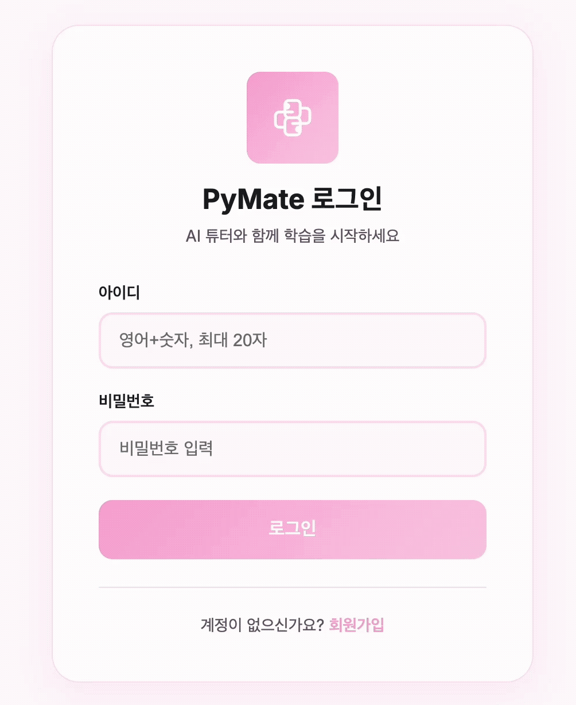
    </td>
    <td align="center">
      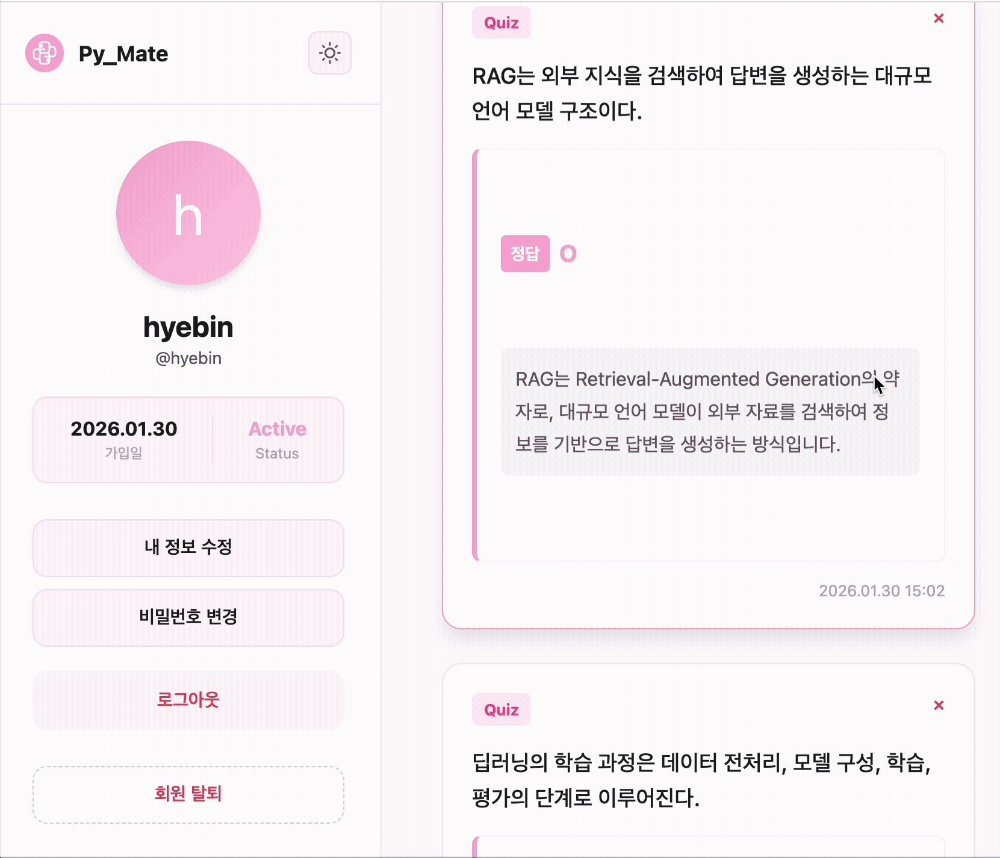
    </td>
  </tr>
</table>

### 2. `학습할래용` 

<table>
  <tr>
    <td align="center">
      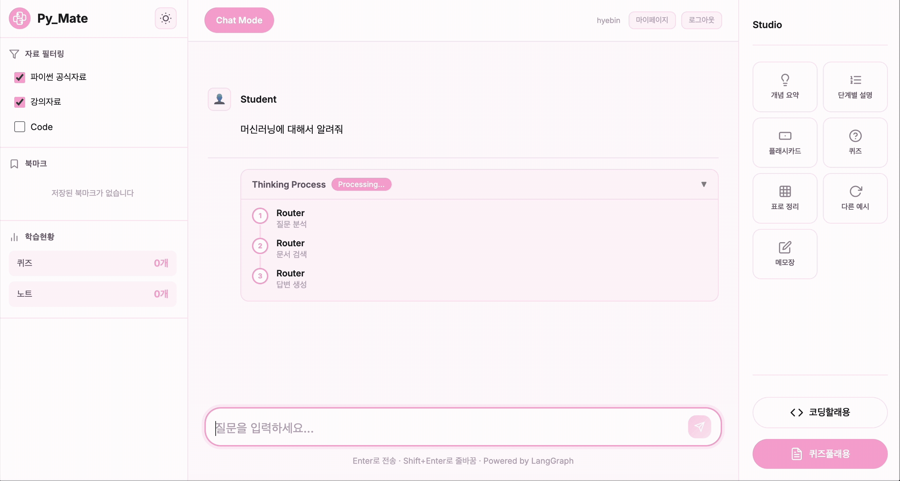
    </td>
    <td align="center">
      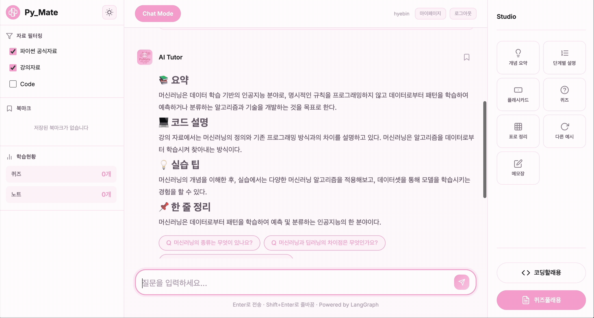
    </td>
  </tr>
</table>

### 3. <우측> `스튜디오` 기능 [개념 요약, 단계별 설명, 플래시카드, 퀴즈, 표로 정리, 다른 예시, 메모장]

[스튜디오_1.gif](images/스튜디오_1.gif)
<p align="center">
        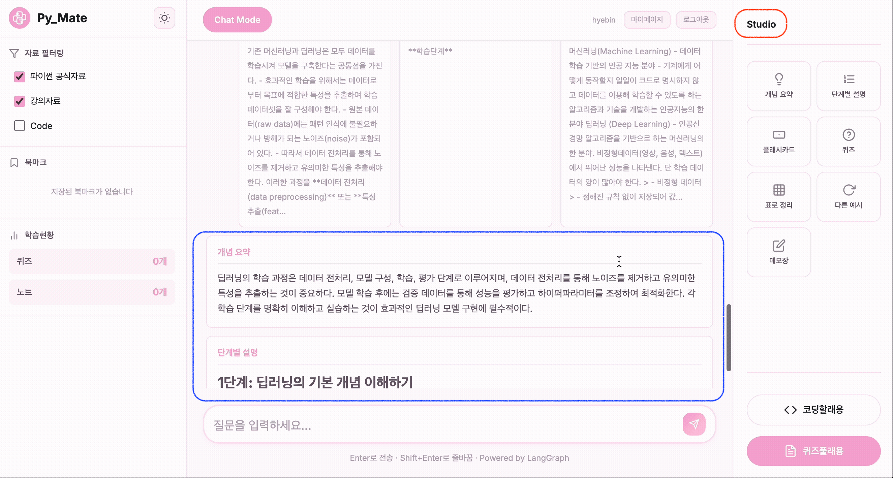
      </p>

[스튜디오_2.gif](images/스튜디오_2.gif)
<p align="center">
        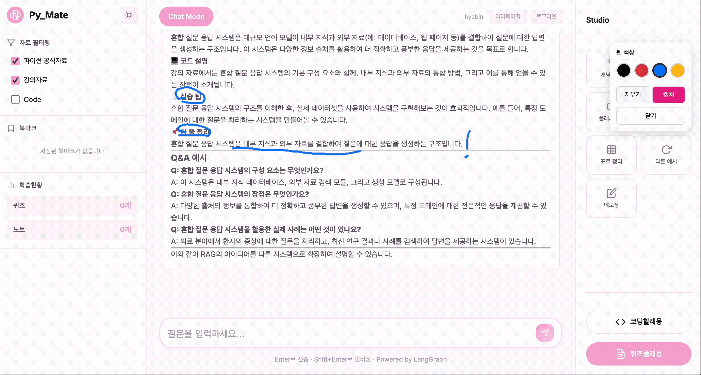
      </p>

### 5. `퀴즈풀래용`

[퀴즈풀래용.gif](images/퀴즈풀래용.gif)
<p align="center">
        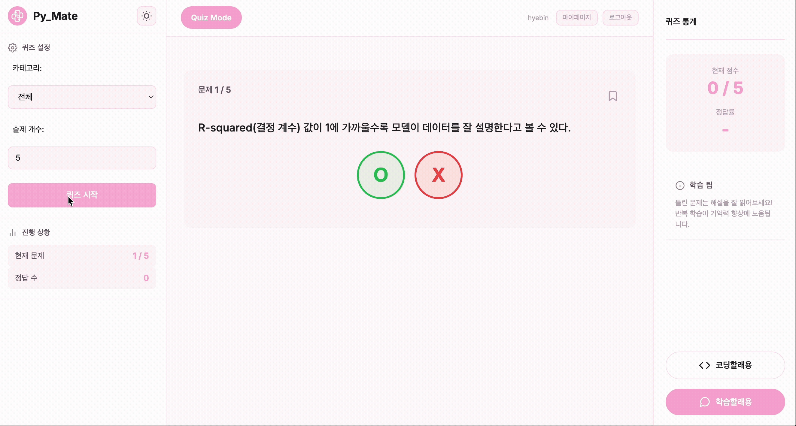
      </p>

### 6. `코딩할래용`

[코딩할래용.gif](images/코딩할래용.gif)
<p align="center">
        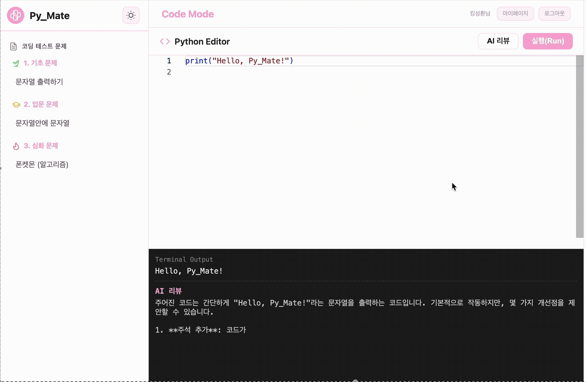
      </p>

### 7. 모바일 UI 모드
<p align="center">
        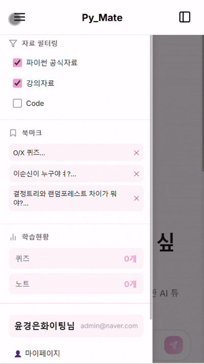
      </p>
      
<br><br>

## RAG 고도화

### 1. 이전 대화 내용 기억하는 Memory Retriever 구현

 <p align="center">
        
      </p>

<br>

### 2. 답변에 강의 코드 추가

학습 자료와 연관된 code를 연동해서 데이터 전처리를 개선함. 그 결과 답변에 강의 코드를 추가할 수 있게 됨.

<div align="center">
  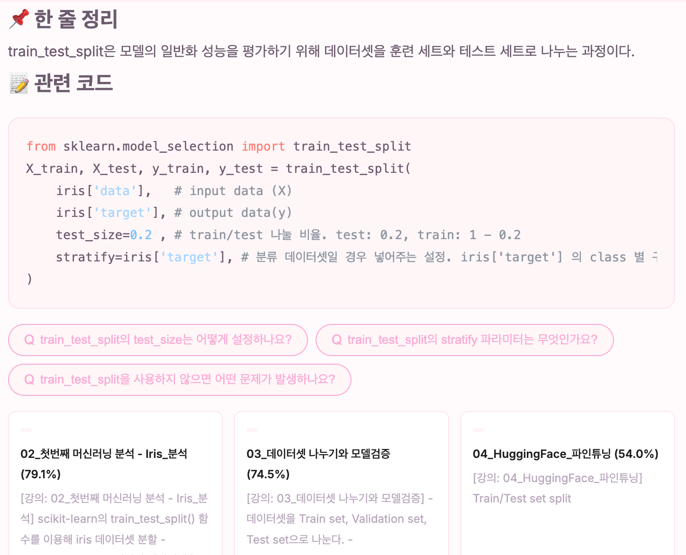
</div>

<br>

### 3. Retrieval : Reranker 모델 도입

**Reranker 모델** : cross-encoder/ms-marco-MiniLM-L6-v2

BAAI/bge-reranker-v2-m3 모델 사용시 속도 저하로 인해 경량화 모델로 변경해서 (-1s) 최종 결정.

> **Context Precision(문맥 정밀도)**

검색된 문서(context)들 중 질문과 관련 있는 것들이 **얼마나 상위 순위에 위치하는지** 평가하는 지표.

- **<span style="color:red">0.8333 ➡️ 0.9758 (↑14.4%)</span>**

> **Context Recall(문맥 재현률)**

검색된 문서(context)가 정답(ground-truth)의 정보를 얼마나 포함하고 있는지 평가하는 지표.

- **<span style="color:red">0.7044 ➡️ 0.7944 (↑12.7%)</span>**

> **LLM 추출 질문에대한 답변 정확도**

답변 못하던 질문들에대해 정성평가에서 뛰어난 답변률을 보여줌

<br><br>

## 시스템 아키텍처

<br>

<p align="center">
  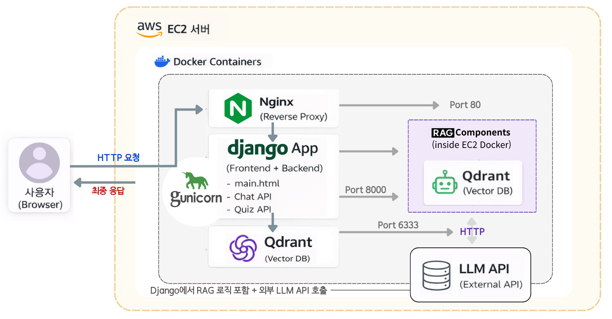
</p>

<br>

### RAG Workflow Flowchart
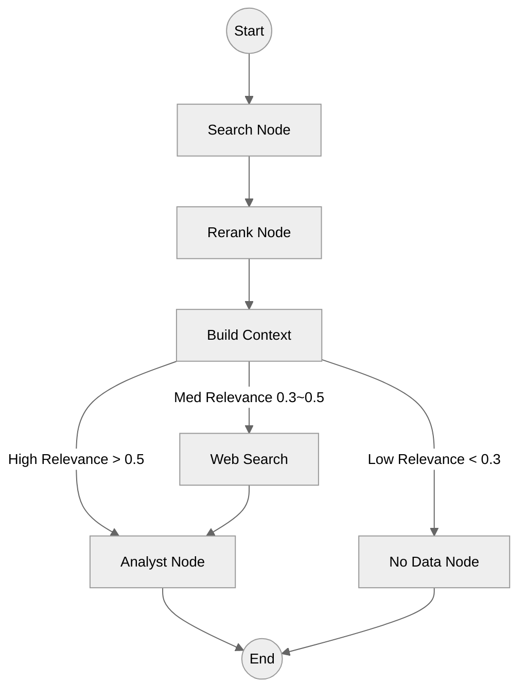

<br><br>


## Database Schema Analysis

### A. PostgreSQL (Relational DB)

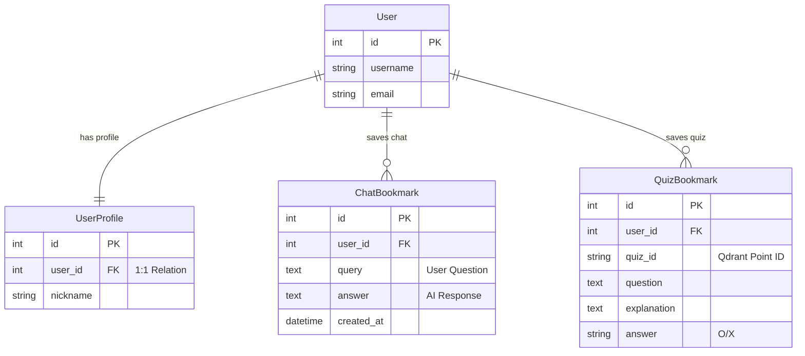

### B. Qdrant (Vector DB)

| Collection Name | Content | Source | Purpose |
|---|---|---|---|
| **learning_ai** | Python Lectures & Docs | `learning_ai.snapshot` | RAG context retrieval for Questions |
| **quizzes** | Generated Quiz Bank | `quizzes.snapshot` | Retrieving similar quizzes or generating new ones |

</br></br>

## 프로젝트 구조

```
SKN21-4th-4Team/
│
├─ app/                 # Django 프로젝트 (Web Application)
│  ├─ manage.py                # Django 관리 스크립트
│  ├─ config/                  # 설정 모듈 (settings, urls, etc.)
│  ├─ backend/                 # API 앱 모음 (accounts, chat, code, quiz)
│  └─ frontend/                # 정적/템플릿 (static, templates)
│
├─ rag/                        # RAG 엔진 및 파이프라인
│  ├─ main.py                  # RAG 메인 진입점
│  ├─ init_setting.py          # Qdrant DB 초기화
│  └─ src/                     # 핵심 로직 (Agent, Retrieval, Ingestion)
│     ├─ agent/                # LangGraph 워크플로우 및 노드
│     ├─ ingestion/            # 데이터 전처리 및 임베딩
│     ├─ retrievals/           # 검색 및 리랭킹 로직
│     ├─ prompts.py            # 프롬프트 모음
│     └─ quiz_service.py       # 퀴즈 생성 로직
│
├─ pymate_deploy/              # 배포 설정 (Docker, Nginx, Shell Scripts)
├─ docs/                       # 프로젝트 문서
├─ data/                       # 데이터셋 (Git 제외)
│
├─ requirements.txt            # 전체 프로젝트 의존성
├─ pyproject.toml              # 프로젝트 설정
├─ intro.md                    # 소개 문서
├─ README.md                   # 메인 README
└─ .env                        # 환경 변수 (Git 제외)
```

원본 데이터(`/data/raw/`)의 경우, 최종 git에서 제거
<br>
<div>

<br>

## Tech Stack

### Core Utilities & Environment


### LLM & RAG Framework


### RAG Evaluation & Similarity


### Embedding & Vector Database


### Backend & API


### Database


## 회고

| 이름 | 소감 |
|------|------|
|**김가람**|데이터 전처리 단계에서 학습 자료와 code를 연동하는 작업을 통해 code를 포함한 답변을 제공할 수 있도록 했습니다. 또한, Self-query, Sparse DB 등을 통해 성능을 개선하려고 했으나 문서의 유사도가 기존보다 낮게 나오는 문제가 발생했고 최종적으로 Reranker를 도입하면서 문서의 유사도를 높일 수 있었고 정성평가에서 기존보다 높은 만족도 결과가 나왔습니다. Advance RAG 방법을 무조건 도입하는 것이 마냥 좋은것이 아니고 프로젝트 구조와 데이터에 따라 결정해야된다는 것을 깨달았습니다. 대화 히스토리를 관리하는 Memory를 구축해 대화가 가능한 챗봇 형태로 구현을 진행하였고, 그 과정에서 이전 대화를 가지고 사용자의 질문에 내용을 추가해주는 프롬프트를 개선했습니다. 3차 프로젝트 끝나고 프롬프트 중요성을 깨달아 프롬프트 작성법을 다시 공부한 점이 큰 도움되었습니다. 우리 팀 모두 고생 많았고 잘했다!|
|**신지용**|      |
|**최자슈아주원**|기존 Flask형식의 3차 프로젝트의  Djoano 변환과 UI/UX 개선을 담당했습니다.  Django로 변환시키는 것은 생각보다 어렵지 않았지만, 전반적인 UI/UX를 개선하는 것은 생각보다 어려웠습니다. 고려해야할 부분이 많고 추가하려는 기능이 많아질수록 복잡해지는 구조가 아쉬웠습니다. 그러면서 생각못한 문제가 발생하고 이러한 문제를 수정하는데 많은 시간이 걸렸습니다. 대부분의 문제는 해결했지만 아직 남아있는 버그에 아쉬움을 느낍니다. 특히 캡쳐를 위한 작업을 전부 했지만 구현하지 못해 아쉽습니다. 다음에는 더 체계적으로 계획을 세우고 진행해야겠습니다. 팀원들의 아이디어와 피드백이 없었다면 지금의 결과물을 만들지 못했을 것입니다. 팀원들에게 감사드립니다. 모두 믿고 맏길 수 있었기에 제 파트에만 집중할 수가 있었습니다. 다시 한번 팀원들에게 감사의 말씀을 전합니다.|
|**윤경은**|이번 프로젝트에서는 3차 프로젝트에서 구축한 LLM 기반 RAG 시스템을 웹 서비스 형태로 확장, 배포하는 과정에 참여 했습니다. 특히 CSS와 JavaScript 파일을 분리하고 Nginx–Gunicorn–Django로 이어지는 서버 흐름을 구성하며 서비스 환경에서의 요청 처리 구조를 이해할 수 있었습니다. 로컬 환경과 배포 환경의 차이로 인해 발생하는 설정 이슈들을 막을 수가 있다는 점을 알게 되었고, 오히려 기능 구현보다 환경 설정 등 구조 이해가 서비스 안정성에 중요할 수 있다는 점을 체감했습니다. 시스템 전체가 어떤 구성과 흐름 속에서 안정적으로 동작하게 되는지 소프트웨어 관점의 중요성을 배울 수 있었던 의미 있는 시간이었습니다.|
|**안혜빈**|      |

